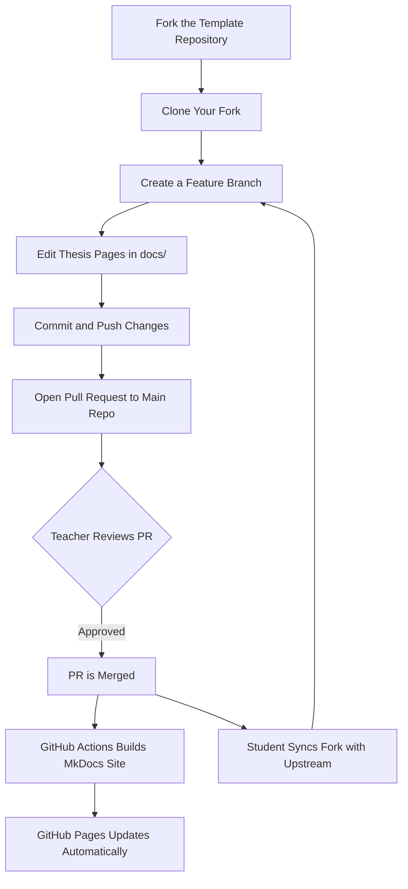

# 📘 Thesis Documentation Template (Markdown + MkDocs)

Welcome to the **Thesis Documentation Template** — a modern, modular, and GitHub-friendly way to write your thesis using:

- **Markdown** for clean writing  
- **MkDocs + Material theme** for beautiful documentation  
- **GitHub + GitHub Pages** for tracking progress and publishing  
- **GitHub Actions** for validating and deploying automatically  

This template follows a **standard academic thesis format** and breaks every section into separate Markdown files for clarity and maintainability.

---

# 📁 Repository Structure

Your thesis content lives entirely inside the `docs/` directory:

```
docs/
│
├── index.md
│
├── 01-front-matter/
│   ├── title-page.md
│   ├── abstract.md
│   ├── table-of-contents.md
│   ├── list-of-figures.md
│   ├── list-of-tables.md
│   └── list-of-notations.md
│
├── 02-introduction/
│   ├── project-context.md
│   ├── purpose-and-description.md
│   ├── objectives.md
│   └── scope-and-limitations.md
│
├── 03-related-literature/
│   └── related-literature.md
│
├── 04-technical-background/
│   └── technical-background.md
│
├── 05-design-and-methodology/
│   ├── conceptual-design.md
│   ├── system-architecture.md
│   ├── block-diagrams.md
│   └── algorithms.md
│
├── 06-results-and-discussion/
│   └── results-and-discussion.md
│
├── 07-conclusions-and-recommendations/
│   └── conclusions-and-recommendations.md
│
├── 08-appendices/
│   ├── source-code.md
│   ├── evaluation-tools.md
│   ├── sample-input-output.md
│   ├── user-guide.md
│   └── cv/
│       ├── member1.md
│       └── member2.md
│
├── img/
└── src/
```

This structure ensures your thesis is:

✔ Modular  
✔ Easy to manage  
✔ Easy to review  
✔ Ready for publication  

---

# 🧩 Requirements

Install MkDocs and the Material theme:

```bash
pip install mkdocs mkdocs-material
```

---

# ▶️ Local Preview

To preview your thesis website locally:

```bash
mkdocs serve
```

Open:

```
http://127.0.0.1:8000/
```

---

# 🌐 GitHub Pages Deployment

This template includes a **single GitHub Action workflow** that handles:

- **Validation** (MkDocs strict build) on every PR → main  
- **Deployment** to GitHub Pages on merge → main  

---

## ✅ One-Time Setup on GitHub Pages

After your first merge to main:

1. Go to **Settings**
2. Select **Pages**
3. Under *Build & Deployment*:
   - **Source:** Deploy from a branch
   - **Branch:** `gh-pages`
   - **Folder:** `/ (root)`
4. Save

Your thesis will be published at:

```
https://<username>.github.io/<repository-name>/
```

Example:

```
https://kinev10.github.io/thesis-markdown-template/
```

---

# 🔄 Updating Your Fork When the Teacher Updates the Template

If you forked this repository, you must manually sync updates.

---

## 🅰️ Option A — GitHub UI (Easiest)

1. Open your fork  
2. Click **Sync fork**  
3. Click **Update branch**

---

## 🅱️ Option B — Git Command Line (Recommended)

Add upstream remote (ONE TIME ONLY):

```bash
git remote add upstream https://github.com/Kinev10/thesis-markdown-template.git
```

Pull updates anytime:

```bash
git pull upstream main
```

---

# 🤝 Contribution Guidelines (For Students)

To maintain clean structure, follow this workflow:

---

## 1️⃣ Create a Feature Branch

```bash
git checkout -b feature/<your-topic>
```

Examples:

- `feature/add-abstract`
- `feature/update-system-architecture`
- `fix/typo-in-chapter-3`

---

## 2️⃣ Write Clear Commit Messages

```
feat: add system architecture diagrams
fix: correct grammar in introduction
docs: update abstract formatting
```

---

## 3️⃣ Small Focused Pull Requests  
Do not mix unrelated changes.

---

## 4️⃣ Open a Pull Request

1. Push your branch  
2. Click **Compare & Pull Request**  
3. Describe your changes  
4. Submit  

---

## 5️⃣ Sync Your Fork Regularly

```bash
git pull upstream main
```

---

## 6️⃣ After Your PR Is Merged

- Changes enter the main thesis repository  
- GitHub Pages automatically updates  
- You may delete your branch  

---

# 🔄 Student Workflow Diagram



---

# ✍️ Editing Your Thesis

Modify content inside:

```
docs/
```

Images go inside:

```
docs/img/
```

Source code, scripts, datasets go inside:

```
docs/src/
```

---

# 🎉 You're Ready!

You now have a complete **Thesis Documentation Template** with:

✔ Clean academic structure  
✔ Markdown-based writing  
✔ Auto-validation on PRs  
✔ Auto-deployment to GitHub Pages  
✔ Student-friendly workflow  
✔ Visual contribution diagram  
